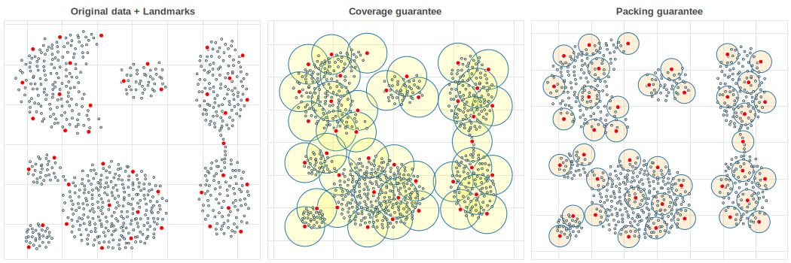

# landmark  

`landmark` is a Python package that constructs $k$ _landmarks_ $L \subset X$ from a point set $X \subset \mathbb{R}^d$ or a metric space $(X, d_X)$ that geometrically approximate the set $X$ that approximate the [metric k-center problem](https://en.wikipedia.org/wiki/Metric_k-center) (also known _k-center clustering_ problem): 

$$ L^\ast(X, k) \triangleq \mathop{\mathrm{arg\,min}}\limits_{\substack{L \subseteq X \, : \, \lvert L \rvert = k}} \ \max_{x \in X} \, d_X(x, L)$$

$k$-center is a classic [NP-hard problem](https://en.wikipedia.org/wiki/List_of_NP-complete_problems) related to many other problems, such as  [geometric set cover](https://en.wikipedia.org/wiki/Geometric_set_cover_problem) and [facility location](https://en.wikipedia.org/wiki/Optimal_facility_location).

<!-- $$ \min\limits_{\substack{L \subseteq X \, : \, \lvert L \rvert = k}} \ \max_{x \in X} \, d_X(x, L)$$ -->
<!-- where $d_X(x, L)$ denotes the Hausdorff distance to the set of landmarks $L$.  -->

## Installation 

Clone and use:

> python -m pip install < landmark-py location >

> Warning: this package is very early-stage, e.g. does not offer wheels on PyPI. Use with care.